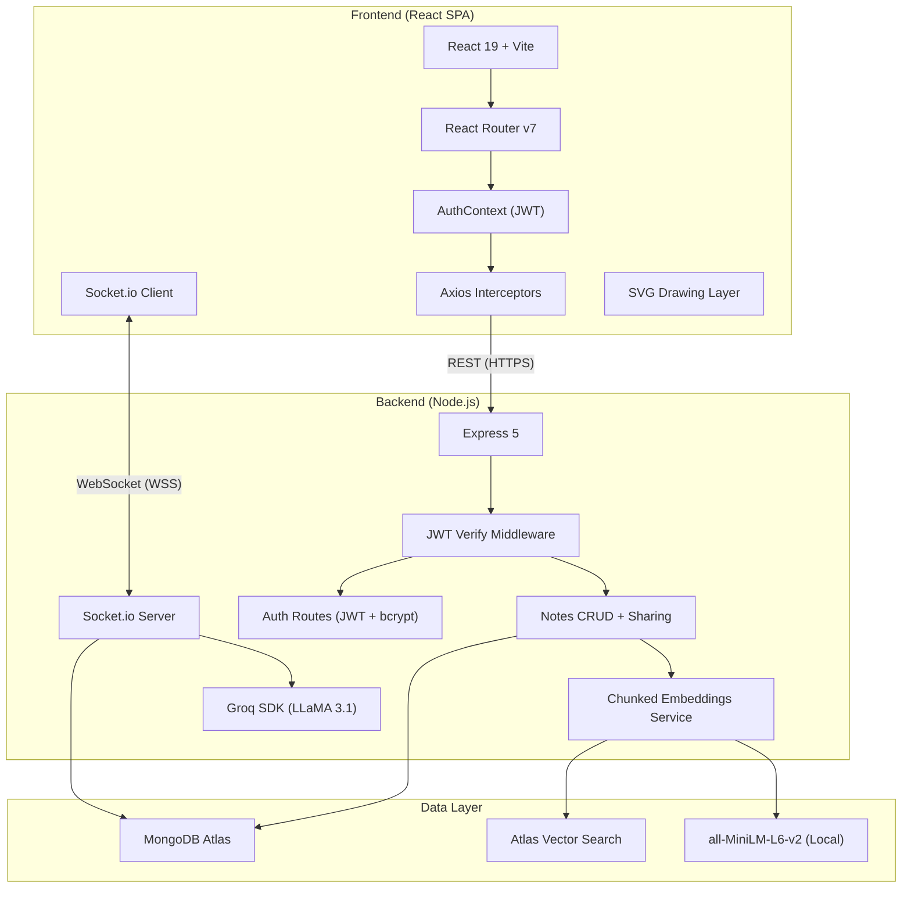
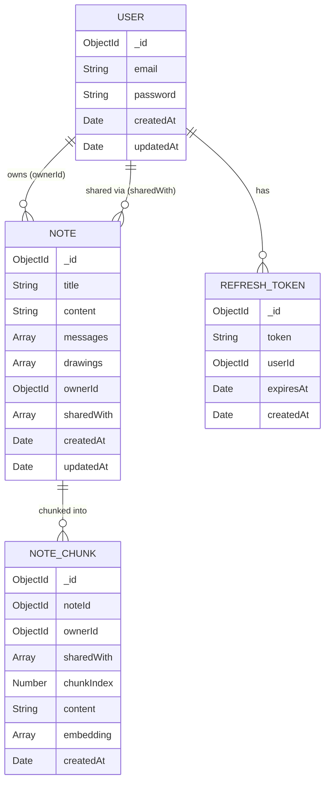

# NoteSync AI — Comprehensive Project Deep-Dive

A production-grade, real-time collaborative notes and drawing application with an embedded AI assistant. This document dissects every layer of the system: architecture, technology choices, tradeoffs, and the reasoning behind each decision.

---

## 1. Project Identity & Purpose

**NoteSync AI** is a multiplayer workspace where users can:
- Collaboratively edit text notes in real-time (Google Docs-style)
- Draw on an infinite vector canvas overlaid on the document (Figma/Miro-style)
- Chat in a group chat panel with an AI assistant that understands the document context (via `@ai` mentions)
- Search notes semantically using RAG (Retrieval-Augmented Generation) with vector embeddings

It's a monorepo with two standalone applications:

| Component | Path | Port |
|---|---|---|
| Frontend (SPA) | [client/](file:///d:/Projects/Realtime%20Notes/client) | `:5173` |
| Backend (API + WebSocket) | [server/](file:///d:/Projects/Realtime%20Notes/server) | `:5000` |

---

## 2. High-Level Architecture



### Communication Patterns

| Channel | Protocol | Purpose |
|---|---|---|
| REST API | HTTP/HTTPS | CRUD operations, auth, note management, semantic search |
| WebSocket | WSS (Socket.io) | Real-time text sync, drawing strokes, chat messages, AI responses |

> [!IMPORTANT]
> The system uses a **dual-protocol architecture**: REST for state-changing CRUD operations (where HTTP semantics like status codes and idempotency matter), and WebSocket for real-time bidirectional streams (where latency matters). This is a deliberate split — not all real-time apps need it, but separating concerns this way keeps the REST API testable and cacheable while the socket layer stays lean and focused on broadcast.

---

## 3. Technology Stack — Complete Breakdown

### 3.1 Language: JavaScript (ES Modules)

**Choice**: JavaScript across the entire stack (frontend + backend)

**Why JavaScript and not TypeScript?**
- This is a solo/small-team project optimized for velocity. TypeScript adds compilation steps, type definitions for every library, and configuration overhead.
- For a project of this size (~20 source files), the DX cost of TypeScript outweighs its safety benefits.
- The project uses `"type": "module"` for native ESM everywhere — clean `import/export` syntax without transpilation.

**Why not Python/Go/Rust for the backend?**
- **Python (Flask/FastAPI)**: Would work, but Socket.io's Node.js implementation is the most mature. Python's `asyncio` + `python-socketio` has a smaller ecosystem and less battle-tested WebSocket scaling.
- **Go**: Excellent for raw performance, but Go's WebSocket libraries require manual room management and broadcast logic that Socket.io gives you for free. Overkill for this scale.
- **Rust**: Same argument as Go, amplified. The development velocity tradeoff doesn't make sense here.

> [!NOTE]
> The **isomorphic JavaScript** choice means one language, one package manager, one mental model. The `socket.io-client` package even appears in both [client/package.json](file:///d:/Projects/Realtime%20Notes/client/package.json) and [server/package.json](file:///d:/Projects/Realtime%20Notes/server/package.json) — shared protocol, zero translation layer.

---

### 3.2 Frontend

#### React 19 (`react@19.1.0`)

**Why React?**
- Dominant ecosystem for building SPAs. Largest community, most battle-tested component model.
- React 19 brings improved concurrent features, better `use()` hook semantics, and server component foundations (not used here but future-proof).

**Why not Vue/Svelte/Angular?**
- **Vue**: Viable alternative. Slightly smaller ecosystem for real-time collaboration patterns. React's Context API pattern is well-suited for the auth + socket state management this app needs.
- **Svelte**: Lighter bundle, but the ecosystem for drawing libraries, socket integration, and icon sets is less mature.
- **Angular**: Massive overhead for this project size. Angular's opinionated structure (modules, services, DI) would be overkill for 4 pages and 1 component.

#### Vite 6 (`vite@6.3.5`)

**Why Vite over Create React App (CRA)?**
- CRA is officially deprecated. Vite is the recommended replacement.
- **Vite uses native ESM** during development — no bundling needed. Hot Module Replacement (HMR) is near-instantaneous because it only transforms the changed module.
- CRA uses Webpack under the hood, which bundles everything on each save. On a project this size, CRA would be ~3-5x slower in dev mode.

**Why not Next.js?**
- Next.js is a full-stack framework with SSR/SSG. This project has a **separate backend** (Express + Socket.io). Using Next.js would mean either:
  - Running two servers (Next API routes + Express for sockets) — pointless complexity
  - Migrating everything into Next.js API routes — losing Socket.io's native Node.js HTTP server integration
- Vite is a **build tool**, not a framework. It stays out of your way and lets you own the architecture.

**Why not Webpack directly?**
- Webpack requires extensive configuration (`webpack.config.js`, loaders, plugins). Vite works with zero config for React via `@vitejs/plugin-react`.

Config is minimal — [vite.config.js](file:///d:/Projects/Realtime%20Notes/client/vite.config.js):
```js
export default defineConfig({
  plugins: [react()],
})
```

#### React Router v7 (`react-router-dom@7.13.0`)

**Why React Router?**
- De facto standard for client-side routing in React apps.
- v7 brings type-safe route definitions and improved data loading patterns.

**Route structure** in [App.jsx](file:///d:/Projects/Realtime%20Notes/client/src/App.jsx):

| Route | Component | Auth Required |
|---|---|---|
| `/login` | `Login` | No |
| `/signup` | `Signup` | No |
| `/` | `Dashboard` | Yes (PrivateRoute) |
| `/note/:id` | `Editor` | Yes (PrivateRoute) |
| `*` | Redirect to `/` | — |

**Why not TanStack Router?**
- TanStack Router is powerful but has a steeper learning curve and is better suited for data-heavy apps with complex loader patterns. This app's routing is simple — 4 routes, no nested layouts.

#### Axios (`axios@1.13.5`)

**Why Axios over native `fetch`?**
- **Interceptors**: The killer feature. [api.js](file:///d:/Projects/Realtime%20Notes/client/src/services/api.js) uses request interceptors to attach JWT tokens and response interceptors for **automatic silent token refresh**. This is non-trivial to implement with raw `fetch`.
- **Automatic JSON parsing**: Axios parses JSON responses automatically. `fetch` requires manual `.json()` calls.
- **Better error handling**: Axios throws on non-2xx status codes. `fetch` considers 404/500 as "successful" responses.

> [!TIP]
> The app actually uses **both** `fetch` and Axios — `fetch` in [AuthContext.jsx](file:///d:/Projects/Realtime%20Notes/client/src/context/AuthContext.jsx) for auth endpoints (login/signup/logout) and Axios everywhere else via the interceptor-equipped instance. This is because auth endpoints don't need the interceptor (they *produce* tokens, not *consume* them).

**Token Refresh Architecture** (in [api.js](file:///d:/Projects/Realtime%20Notes/client/src/services/api.js)):
```
Request fails with 401/403
    ├── Is a refresh already in-flight? 
    │     ├── YES → Queue this request, resolve when refresh completes
    │     └── NO  → Start refresh
    │               ├── POST /api/auth/refresh with refreshToken
    │               ├── Store new accessToken + rotated refreshToken
    │               ├── Notify all queued requests with new token
    │               └── Retry original request
    └── Refresh fails → Clear all tokens → Redirect to /login
```

This **subscriber pattern** prevents concurrent 401 errors from triggering multiple refresh calls — a classic race condition in token-based auth.

#### Lucide React (`lucide-react@0.563.0`)

**Why Lucide over Font Awesome / Material Icons / Heroicons?**
- **Tree-shakeable**: Import only the icons you use. Font Awesome loads entire icon font files.
- **React-native components**: Each icon is a proper React component with props for `size`, `color`, `strokeWidth` — not CSS class names.
- **Consistent design language**: Lucide is a fork of Feather Icons with 1,500+ icons in a unified stroke style.
- **Tiny per-icon cost**: ~200 bytes per icon vs Font Awesome's ~100KB+ font file.

#### Socket.io Client (`socket.io-client@4.8.3`)

**Why Socket.io over raw WebSockets?**
- **Automatic reconnection**: Socket.io handles dropped connections, exponential backoff, and session resumption transparently.
- **Room abstraction**: The server can `socket.join(noteId)` and `socket.to(noteId).emit(...)` — broadcasting to specific note rooms without manual connection tracking.
- **Fallback transports**: If WebSocket fails (corporate proxies, strict firewalls), Socket.io falls back to HTTP long-polling. Raw WebSockets just fail.
- **Binary/JSON serialization**: Socket.io handles object serialization natively. Raw WebSockets only send strings/ArrayBuffers.

**Why not WebRTC / CRDT / Yjs?**
- **WebRTC**: Peer-to-peer, no server needed for data channels — but requires a signaling server anyway, and NAT traversal (TURN servers) adds operational cost. For a centralized app with MongoDB persistence, server-mediated WebSocket is simpler.
- **Yjs/Automerge (CRDTs)**: These are conflict-free replicated data types designed for offline-first collaborative editing. They're the gold standard for Google Docs-like editing but add significant complexity. This project uses a **last-write-wins** model via socket broadcast — simpler, works well for small teams, but won't handle offline conflict resolution.

> [!WARNING]
> The current text sync model is **last-write-wins**: when two users type simultaneously, the last `edit-note` event wins. This is acceptable for small team collaboration but will cause character-level conflicts at scale. A production-grade solution would integrate Yjs or Automerge for Operational Transformation (OT) / CRDT-based merging.

---

### 3.3 Backend

#### Node.js + Express 5 (`express@5.2.1`)

**Why Express?**
- The most mature HTTP framework for Node.js. Express 5 brings `async` error handling (no more `next(err)` for async routes), improved path matching, and Promise-based middleware.
- Express 5 is a deliberate choice over Express 4 — async route handlers (`async (req, res) => { ... }`) automatically catch errors without wrapper functions.

**Why not Fastify / Koa / Hono?**
- **Fastify**: 2-3x faster than Express in benchmarks, but Express's middleware ecosystem is unmatched. Fastify's schema-based validation is powerful but adds boilerplate for a project this size.
- **Koa**: Minimalist, but requires assembling middleware for everything (body parsing, routing, CORS). Express includes these out of the box.
- **Hono**: Emerging framework optimized for edge runtimes (Cloudflare Workers). Overkill here — the app needs a persistent Node.js process for Socket.io.

**Server Architecture** in [index.js](file:///d:/Projects/Realtime%20Notes/server/src/index.js):
```
HTTP Server (http.createServer)
├── Express App (middleware: cors, json parsing)
│   ├── /api/auth/* → Auth routes
│   ├── /api/notes/* → Notes CRUD routes  
│   ├── /health → Health check
│   └── / → Status endpoint
└── Socket.io Server (attached to same HTTP server)
    └── Socket handler (real-time events)
```

> [!NOTE]
> Express and Socket.io share the **same HTTP server** via `http.createServer(app)`. This is critical — it means one port, one deployment, one process. Separating them would require a reverse proxy or separate deployments.

#### Socket.io Server (`socket.io@4.8.3`)

The real-time engine. Handles 9 distinct event types in [sockets/index.js](file:///d:/Projects/Realtime%20Notes/server/src/sockets/index.js):

| Event | Direction | Purpose |
|---|---|---|
| `join-note` | Client → Server | Join a note's room, broadcast presence |
| `edit-note` | Client → Server → Clients | Text content changes |
| `draw-progress` | Client → Server → Clients | Live drawing stroke in-progress |
| `draw-stroke` | Client → Server → Clients + DB | Completed stroke, persisted |
| `delete-stroke` | Client → Server → Clients + DB | Erase a stroke |
| `clear-drawings` | Client → Server → Clients + DB | Clear entire canvas |
| `send-chat` | Client → Server → Clients + AI | Chat message, triggers AI if `@ai` |
| `leave-note` | Client → Server → Clients | Leave room notification |
| `disconnect` | Auto | Socket cleanup |

**AI Chat Flow** (the most complex event):
```
User sends "@ai what does this mean?"
    ├── Persist user message to MongoDB ($push atomic)
    ├── Broadcast to room via socket
    ├── Emit 'ai-typing' indicator to room
    ├── Build context:
    │   ├── Last 8 chat messages (token budget control)
    │   ├── First 2,500 chars of document content
    │   └── RAG: Vector search for 3 most relevant notes
    ├── Send prompt to Groq API (LLaMA 3.1 8B)
    ├── Persist AI response to MongoDB
    ├── Emit 'ai-typing' = false
    └── Broadcast AI message to room
```

#### Mongoose 9 (`mongoose@9.6.1`)

**Why Mongoose over native MongoDB driver?**
- **Schema validation**: The native driver is schemaless — you can insert anything. Mongoose schemas enforce structure at the application layer (see [Note.js](file:///d:/Projects/Realtime%20Notes/server/src/models/Note.js), [User.js](file:///d:/Projects/Realtime%20Notes/server/src/models/User.js)).
- **Middleware hooks**: `pre('save')`, `post('find')` — useful for automatic hashing, logging.
- **Population**: `Note.find().populate('ownerId', 'email')` auto-joins across collections. The native driver requires manual `$lookup` aggregations.
- **Index management**: `noteSchema.index({ ownerId: 1 })` declaratively ensures query performance.

**Why MongoDB over PostgreSQL/MySQL?**
- **Schema flexibility**: Notes contain heterogeneous data — text content, nested message arrays, drawing stroke arrays with variable-length point arrays, embedding vectors. This maps naturally to MongoDB's document model. In PostgreSQL, you'd need separate tables + joins or JSONB columns (losing query performance).
- **Atlas Vector Search**: MongoDB Atlas natively supports `$vectorSearch` aggregation — the RAG pipeline in [embeddings.js](file:///d:/Projects/Realtime%20Notes/server/src/services/embeddings.js) uses this for semantic search without a separate vector database.
- **Atomic array operations**: `$push`, `$pull`, `$set` on nested arrays (messages, drawings, sharedWith) are first-class operations. In SQL, you'd need junction tables and transactions.

**Why not PostgreSQL + pgvector?**
- PostgreSQL + pgvector is a viable alternative for vector search. However, the document-oriented nature of notes (nested messages, variable-length drawing arrays) fits MongoDB more naturally. Using PostgreSQL would require:
  - Separate `messages` and `drawings` tables with foreign keys
  - Joins on every note fetch
  - Transactions for atomic multi-table updates
  - pgvector extension installation and maintenance

**Data Models**:



**Performance Optimizations in the data layer**:
1. **Compound indexes** on `ownerId` and `sharedWith` for fast note retrieval ([Note.js:L20-21](file:///d:/Projects/Realtime%20Notes/server/src/models/Note.js#L20-L21))
2. **TTL index** on `RefreshToken.expiresAt` — MongoDB automatically garbage-collects expired tokens ([RefreshToken.js:L10](file:///d:/Projects/Realtime%20Notes/server/src/models/RefreshToken.js#L10))
3. **Selective projection** — dashboard queries exclude `drawings` arrays (which can be massive) via `.select('title content createdAt...')` ([notes.js:L48](file:///d:/Projects/Realtime%20Notes/server/src/routes/notes.js#L48))
4. **Atomic updates** — `Note.updateOne({ $set })` bypasses full document hydration ([notes.js:L101-104](file:///d:/Projects/Realtime%20Notes/server/src/routes/notes.js#L101-L104))
5. **`.lean()`** — returns plain JS objects instead of Mongoose documents (no change tracking overhead)
6. **Denormalized chunk access** — `NoteChunk` documents carry their own `ownerId`/`sharedWith` copies so vector search can filter by user access without cross-collection `$lookup` joins ([NoteChunk.js](file:///d:/Projects/Realtime%20Notes/server/src/models/NoteChunk.js))

---

### 3.4 Authentication System

The auth system in [routes/auth.js](file:///d:/Projects/Realtime%20Notes/server/src/routes/auth.js) implements a **JWT access + refresh token rotation** pattern:

| Token | Lifetime | Storage | Purpose |
|---|---|---|---|
| Access Token | 15 minutes | `localStorage` | Short-lived, attached to every API request |
| Refresh Token | 7 days | `localStorage` + MongoDB | Long-lived, used to obtain new access tokens |

#### bcryptjs (`bcryptjs@3.0.3`)

**Why bcrypt?**
- Industry standard for password hashing. Uses a **salt + adaptive cost factor** (10 rounds here) making brute-force attacks computationally expensive.
- `bcryptjs` is a pure JavaScript implementation (no native C++ bindings). This avoids build issues on platforms like Render, Vercel, and Windows.

**Why not Argon2/scrypt?**
- Argon2 (winner of PHC competition) is technically superior — it's memory-hard, making GPU attacks expensive. However, `argon2` npm package requires native compilation (C bindings), which can fail on certain hosting platforms. `bcryptjs` trades marginal security for universal deployability.

#### jsonwebtoken (`jsonwebtoken@9.0.3`)

**Why JWT over session-based auth?**
- **Stateless**: JWTs are self-contained — the server doesn't need to query a session store on every request. With Socket.io handling persistent connections, minimizing per-request database lookups is important.
- **Multi-client friendly**: JWTs work across multiple frontends (web, mobile, desktop) without server-side session affinity.
- **Microservice-ready**: If the backend is split later, any service can verify a JWT independently.

**Why not session cookies?**
- Session cookies require server-side storage (Redis/MongoDB sessions), CSRF protection, and same-origin constraints. JWTs in `localStorage` work across subdomains and don't need CSRF tokens (they're sent via `Authorization` header, not cookies).

> [!CAUTION]
> Storing JWTs in `localStorage` is vulnerable to **XSS attacks** — any injected script can read the token. A more secure approach would use `httpOnly` cookies (immune to XSS) with CSRF protection. The current approach trades security for simplicity.

**Refresh Token Rotation** — security mechanism in [auth.js:L96-133](file:///d:/Projects/Realtime%20Notes/server/src/routes/auth.js#L96-L133):
- When a refresh token is used, it's **atomically deleted** (`findOneAndDelete`) and a new one is issued.
- This means a stolen refresh token can only be used once. If an attacker uses it, the legitimate user's next refresh will fail, alerting them.
- Expired tokens are also auto-cleaned by MongoDB's TTL index.

---

### 3.5 AI & RAG Pipeline

#### Groq SDK (`groq-sdk@1.1.2`) — LLaMA 3.1 8B Instant

**Why Groq over OpenAI / Anthropic / Local LLMs?**
- **Speed**: Groq runs on custom LPU (Language Processing Unit) hardware. LLaMA 3.1 8B inference is **~10x faster** than GPU-based providers. For a real-time chat where users expect near-instant responses, latency is critical.
- **Cost**: Groq's pricing for 8B models is significantly cheaper than GPT-4o or Claude. For a collaborative notes app where every `@ai` mention triggers an API call, cost compounds fast.
- **Open model**: LLaMA 3.1 is open-source (Meta). No vendor lock-in to OpenAI's proprietary models.

**Why LLaMA 3.1 8B and not 70B or 405B?**
- 8B is the speed-optimized variant. The AI assistant answers questions about a specific document — it doesn't need the world-knowledge or reasoning depth of 70B/405B.
- Smaller models have lower latency, which matters in a real-time chat UX.

**Why not OpenAI?**
- OpenAI's API is 3-10x slower for comparable model sizes. GPT-4o is more capable but adds 2-5 seconds of latency per response — unacceptable in a real-time chat.
- OpenAI charges per token at higher rates.

**Why not a local LLM (Ollama/llama.cpp)?**
- Local inference requires a GPU on the server. Cloud hosting (Render, Railway) typically provides CPU-only instances. An API-based approach keeps infrastructure simple.

#### @xenova/transformers (`@xenova/transformers@2.17.2`) — Local Embeddings

**Why local embeddings (all-MiniLM-L6-v2) instead of an API?**

This is one of the most interesting architectural decisions in the project.

The embedding pipeline in [embeddings.js](file:///d:/Projects/Realtime%20Notes/server/src/services/embeddings.js) runs **all-MiniLM-L6-v2 locally in Node.js** via `@xenova/transformers` (a WASM/ONNX port of Hugging Face Transformers):

```
Chat completions (LLM)  →  Remote API (Groq)     →  Needs intelligence
Embeddings (vectors)    →  Local model (MiniLM)   →  Needs only math
```

**Why this split?**
- **Embeddings are cheap computation**: Generating a 384-dimensional vector from text is a simple forward pass through a small transformer. No need to pay per-API-call for this.
- **Zero API dependency for search**: Semantic search works even if Groq is down. The embedding model runs locally.
- **No API key required for embeddings**: One less external dependency to configure.
- **Privacy**: Document content never leaves the server for embedding generation.

**Why all-MiniLM-L6-v2 specifically?**
- 384-dimensional output — compact enough to store in MongoDB documents without bloating storage.
- ~22M parameters — loads in seconds, runs fast on CPU.
- Excellent quality-to-size ratio for semantic similarity tasks (sentence-level understanding).
- 256-token context window — a perfect fit for 500-character chunks.

**Why not OpenAI's `text-embedding-3-small` or Cohere embeddings?**
- API cost on every note save and every search query. With chunking, a single note update can generate 5-10+ embedding API calls. This would compound fast.
- Added latency (network round-trip) on the search path.
- The quality difference between MiniLM and API embeddings is marginal for short-text similarity at the chunk level.

**Singleton Pattern (Promise Caching)** ([embeddings.js:L10-18](file:///d:/Projects/Realtime%20Notes/server/src/services/embeddings.js#L10-L18)):
```js
let extractorPromise = null;
async function getExtractor() {
    if (!extractorPromise) {
        extractorPromise = pipeline('feature-extraction', 'Xenova/all-MiniLM-L6-v2');
        extractorPromise.then(() => console.log('Model loaded'));
    }
    return extractorPromise;
}
```
**Why cache the Promise and not the Model?**
When a note is chunked, 10+ chunks might request the embedding model concurrently via `Promise.all`. If we only cached the resolved model, all 10 concurrent calls would see `model === null` before the first load finished, triggering 10 parallel 22MB model downloads and causing an instant Node.js Out-Of-Memory (OOM) crash. By caching the **Promise itself**, all concurrent callers instantly await the exact same initial load operation.

#### Text Chunking Pipeline

Notes are **not** embedded as monolithic documents. Instead, the system splits each note into **overlapping chunks** and embeds each chunk independently ([embeddings.js:L43-68](file:///d:/Projects/Realtime%20Notes/server/src/services/embeddings.js#L43-L68)):

```
"Hello world. This is a 2000-char note..." (2000 chars)
    ↓ chunkText(chunkSize=500, overlap=100)
    ├── Chunk 0: chars 0–500    → 384-dim embedding → NoteChunk doc
    ├── Chunk 1: chars 400–900  → 384-dim embedding → NoteChunk doc
    ├── Chunk 2: chars 800–1300 → 384-dim embedding → NoteChunk doc
    └── Chunk 3: chars 1200–2000 → 384-dim embedding → NoteChunk doc
```

**Chunking parameters** (`CHUNK_SIZE = 500`, `CHUNK_OVERLAP = 100`):
- **500 chars** fits comfortably within MiniLM's 256-token window (~2 chars/token average).
- **100-char overlap** ensures that sentences straddling chunk boundaries are captured in at least one chunk — no semantic information is lost at the cut points.
- Chunks break on **word boundaries** (`lastIndexOf(' ')`) to avoid splitting mid-word.

**Why chunk and not embed the whole note?**
- MiniLM has a 256-token context window. A 5,000-char note gets truncated to ~1,500 chars, losing everything after. Chunking ensures the entire note is searchable.
- Vector search retrieves the **specific passage** relevant to the query, not the entire note. The AI gets precisely the context it needs.
- Shorter texts produce higher-quality embeddings — the signal isn't diluted by irrelevant paragraphs.

**Fire-and-Forget Chunk Updates** ([notes.js:L25-28](file:///d:/Projects/Realtime%20Notes/server/src/routes/notes.js#L25-L28)):
```js
// Fire-and-forget: chunk and embed new note
if (content) {
    updateNoteChunks(note._id, userId, [], title, content);
}
```
Chunking + embedding happens **asynchronously without awaiting**. All chunk embeddings are generated in parallel via `Promise.all` ([embeddings.js:L97-99](file:///d:/Projects/Realtime%20Notes/server/src/services/embeddings.js#L97-L99)). The API response returns immediately.

When a note is updated, all existing chunks are **atomically replaced** (delete old → insert new). When a note is deleted, its chunks are cleaned up. When a note is shared, the denormalized `sharedWith` array on all chunks is synced.

#### MongoDB Atlas Vector Search

Semantic search operates on the `notechunks` collection via `$vectorSearch` ([embeddings.js:L155-186](file:///d:/Projects/Realtime%20Notes/server/src/services/embeddings.js#L155-L186)):

```js
NoteChunk.aggregate([
    {
        $vectorSearch: {
            index: 'chunk_embedding_index',
            path: 'embedding',
            queryVector: queryEmbedding,
            numCandidates: limit * 10,
            limit: limit,
            filter: {
                $or: [
                    { ownerId: ObjectId(userId) },
                    { sharedWith: ObjectId(userId) }
                ]
            }
        }
    }
])
```

Results are then **deduplicated by noteId** — only the highest-scoring chunk per note is kept, and parent note titles are fetched via a follow-up query.

**Atlas Vector Search Index Definition** (apply via Atlas UI → Search Indexes → JSON Editor on `notechunks`):
```json
{
  "fields": [
    { "type": "vector", "path": "embedding", "numDimensions": 384, "similarity": "cosine" },
    { "type": "filter", "path": "ownerId" },
    { "type": "filter", "path": "sharedWith" }
  ]
}
```
Index name must be `chunk_embedding_index`.

**Why not Pinecone / Weaviate / Qdrant (dedicated vector DBs)?**
- Chunks are stored in a dedicated `NoteChunk` collection alongside the main `notes` collection. No separate database to manage, no data sync pipeline, no additional hosting cost.
- MongoDB Atlas Vector Search supports filtered search — the query respects ownership (`ownerId`) and sharing (`sharedWith`) ACLs natively via denormalized fields on each chunk.
- For the scale of this app (hundreds to low thousands of chunks), Atlas Vector Search is more than sufficient. Dedicated vector databases shine at millions+ vectors.

---

### 3.6 Real-Time Drawing System

The drawing system is implemented as an **SVG overlay** on top of the text editor:

```
┌─────────────────────────────────────┐
│  SVG Overlay (z-index: 5 or 15)    │  ← Vector drawing layer
│  ┌─────────────────────────────┐    │
│  │  Textarea (z-index: 10)     │    │  ← Text editing layer
│  │                             │    │
│  └─────────────────────────────┘    │
└─────────────────────────────────────┘
```

**Why SVG over HTML5 Canvas?**
- **Vector-based**: SVG strokes are DOM elements with `<path>` definitions. They can be individually selected, deleted, and manipulated. Canvas is pixel-based — once drawn, you can't select individual strokes without rebuilding the entire canvas.
- **React integration**: SVG elements are part of the React component tree. State changes (adding/removing strokes) trigger re-renders naturally. Canvas requires imperative `context.drawImage()` calls outside React's declarative model.
- **Resolution-independent**: SVG scales perfectly at any zoom level. Canvas gets blurry when zoomed.
- **Serialization**: Stroke data is just arrays of `{x, y}` points with color/width metadata — trivially serializable to JSON for MongoDB storage and socket transmission.

**Why not Canvas?**
- Canvas would be faster for thousands of strokes (GPU-accelerated pixel blitting). But for collaborative annotation (dozens of strokes, not thousands), SVG's benefits outweigh its rendering overhead.

**Coordinate System** ([Editor.jsx:L249-255](file:///d:/Projects/Realtime%20Notes/client/src/pages/Editor.jsx#L249-L255)):
```js
const getSvgPoint = (e) => {
    const rect = svg.getBoundingClientRect();
    const x = e.clientX - rect.left;
    const y = (e.clientY - rect.top) + scrollTop;
    return { x, y };
};
```
Points are stored in **absolute document coordinates** (including scroll offset). This means drawings remain anchored to the correct position in the document regardless of viewport scroll — essential for annotation use cases.

**Real-Time Drawing Protocol**:
```
User draws                        Other users see
────────────                      ────────────────
mousedown → draw-progress ──────→ remoteActiveStrokes (live preview)
mousemove → draw-progress ──────→ remoteActiveStrokes (updated)
mouseup   → draw-stroke   ──────→ drawings (committed) + DB persist
```

The `draw-progress` events provide a **live preview** of in-progress strokes, while `draw-stroke` commits the final stroke. This two-phase approach gives other users visual feedback without persisting every intermediate point to the database.

---

### 3.7 CSS Architecture

The entire UI is styled with **vanilla CSS** in a single file: [App.css](file:///d:/Projects/Realtime%20Notes/client/src/App.css) (~1,776 lines).

**Design System**:
- **Dark theme**: Deep navy/slate palette (`#090d16`, `#0b0f19`, `#0d121f`)
- **Glassmorphism**: `backdrop-filter: blur(28px)` on card containers
- **Gradient accents**: Indigo → Purple (`#6366f1` → `#a855f7`)
- **Micro-animations**: Scale-up entrance (`scaleUpPremium`), shake on error (`shakePremium`), spin on refresh

**Why vanilla CSS over Tailwind/CSS-in-JS?**
- **Full control**: Complex animations, glassmorphism effects, and gradient compositions are easier to express in vanilla CSS than Tailwind utility classes.
- **No build dependency**: No PostCSS processing, no `tailwind.config.js`, no purging.
- **Readability**: `.premium-note-card:hover { transform: translateY(-4px) }` is more readable than `hover:-translate-y-1` for someone reviewing the code.

**Why not Tailwind?**
- Tailwind excels at rapid prototyping but makes complex compositions verbose. A single card hover effect in this project requires `transform`, `border-color`, `background`, and `box-shadow` changes — that's 4+ Tailwind classes per state.
- The project uses semantic class names (`.dashboard-sidebar`, `.chat-message`, `.drawing-toolbar`) that are self-documenting.

---

### 3.8 Development & DevOps

#### Nodemon (`nodemon@3.1.11`)

Auto-restarts the Node.js server on file changes. Development-only dependency — production uses `node src/index.js` directly.

#### ESLint 9 (client-side)

Configured for React hooks rules (`eslint-plugin-react-hooks`) and React Refresh (`eslint-plugin-react-refresh`). Ensures hooks are called correctly and components are compatible with Vite's HMR.

#### Vercel Deployment ([vercel.json](file:///d:/Projects/Realtime%20Notes/client/vercel.json))

```json
{
  "rewrites": [{ "source": "/(.*)", "destination": "/index.html" }]
}
```
This is the **SPA fallback** — all routes are rewritten to `index.html` so React Router handles client-side routing. Without this, refreshing `/note/abc123` on Vercel would return a 404.

#### k6 Load Testing ([load_test.js](file:///d:/Projects/Realtime%20Notes/load_test.js))

**Why k6 over Artillery/JMeter/Locust?**
- k6 has native WebSocket support — it can speak the Socket.io wire protocol (Engine.IO framing: `0` for handshake, `40` for namespace, `42` for events, `2`/`3` for heartbeat).
- k6 scripts are plain JavaScript — consistent with the rest of the codebase.
- k6 is compiled Go, so it's extremely efficient at generating load (20 VUs broadcasting every 100ms = 200 messages/second).

The test simulates 20 concurrent users joining the same room and broadcasting drawing strokes every 100ms for 15 seconds — stress-testing the Socket.io fan-out broadcast pattern.

---

## 4. Server Directory Structure

```
server/
├── src/
│   ├── index.js              ← Entry point: Express + Socket.io server setup
│   ├── config/
│   │   └── db.js             ← MongoDB connection via Mongoose
│   ├── middleware/
│   │   └── auth.js           ← JWT verification middleware
│   ├── models/
│   │   ├── User.js           ← User schema (email, password)
│   │   ├── Note.js           ← Note schema (content, messages, drawings)
│   │   ├── NoteChunk.js      ← Chunk schema (content, embedding, denormalized ACL)
│   │   └── RefreshToken.js   ← Refresh token schema (TTL-indexed)
│   ├── routes/
│   │   ├── auth.js           ← Register, Login, Refresh, Logout endpoints
│   │   └── notes.js          ← CRUD, Share, Semantic Search + chunk lifecycle
│   ├── services/
│   │   └── embeddings.js     ← Chunking, local MiniLM embeddings, Atlas Vector Search
│   └── sockets/
│       └── index.js          ← All real-time event handlers
├── .env / .env.example
└── package.json
```

## 5. Client Directory Structure

```
client/
├── src/
│   ├── main.jsx              ← React DOM entry point
│   ├── App.jsx               ← Router + AuthProvider setup
│   ├── App.css               ← All styles (~1,776 lines)
│   ├── index.css             ← CSS reset + variables
│   ├── context/
│   │   └── AuthContext.jsx   ← Auth state management (login/signup/logout)
│   ├── services/
│   │   └── api.js            ← Axios instance with token refresh interceptors
│   ├── components/
│   │   └── PrivateRoute.jsx  ← Auth guard wrapper
│   └── pages/
│       ├── Login.jsx         ← Login page with demo credentials
│       ├── Signup.jsx        ← Registration page
│       ├── Dashboard.jsx     ← Notes grid, search, semantic search toggle
│       └── Editor.jsx        ← Full editor: text + SVG drawing + chat sidebar
├── vercel.json               ← SPA routing for Vercel deployment
├── vite.config.js            ← Vite build configuration
└── package.json
```

---

## 6. API Endpoint Reference

### Auth Routes (`/api/auth`)

| Method | Endpoint | Auth | Description |
|---|---|---|---|
| POST | `/register` | No | Create account, return token pair |
| POST | `/login` | No | Authenticate, return token pair |
| POST | `/refresh` | No | Rotate refresh token, get new access token |
| POST | `/logout` | No | Revoke refresh token |

### Notes Routes (`/api/notes`)

| Method | Endpoint | Auth | Description |
|---|---|---|---|
| POST | `/` | JWT | Create new note |
| GET | `/` | JWT | List all accessible notes (owned + shared) |
| GET | `/:id` | JWT | Get single note with full data |
| PUT | `/:id` | JWT | Update note (title, content, drawings) |
| DELETE | `/:id` | JWT | Delete note (owner only) |
| POST | `/:id/share` | JWT | Share note with another user by email |
| POST | `/search` | JWT | Semantic search via RAG embeddings |

---

## 7. Key Tradeoffs Summary

| Decision | Chose | Over | Why |
|---|---|---|---|
| Language | JavaScript | TypeScript | Velocity for project size |
| Frontend framework | React 19 | Vue/Svelte/Angular | Ecosystem + community |
| Build tool | Vite | CRA/Webpack/Next.js | Speed + zero-config + separate backend |
| Database | MongoDB | PostgreSQL | Document model fits schema, Atlas Vector Search |
| Real-time | Socket.io | Raw WS/WebRTC | Rooms, reconnection, fallbacks |
| Text sync | Last-write-wins | CRDTs (Yjs) | Simplicity (tradeoff: no offline/conflict resolution) |
| Drawing | SVG overlay | Canvas | Selectable strokes, React integration |
| LLM inference | Groq (LLaMA 3.1 8B) | OpenAI/Anthropic | Speed (10x), cost, open model |
| Embeddings | Local (MiniLM) | API (OpenAI) | Zero cost, zero latency, privacy |
| RAG granularity | Overlapping chunks (500/100) | Whole-document embedding | Full-note coverage, precise retrieval |
| Vector DB | Atlas Vector Search | Pinecone/Weaviate | No separate infra, co-located with data |
| Chunk ACL | Denormalized on chunks | Cross-collection $lookup | Vector search filter performance |
| Password hash | bcryptjs | Argon2 | Universal deployability |
| Token storage | localStorage | httpOnly cookies | Simplicity (tradeoff: XSS vulnerability) |
| CSS | Vanilla | Tailwind/CSS-in-JS | Full control for complex effects |
| Load testing | k6 | Artillery/JMeter | Native WebSocket support, JS-based |

---

## 8. Environment Variables

### Server ([.env.example](file:///d:/Projects/Realtime%20Notes/server/.env.example))

| Variable | Purpose |
|---|---|
| `PORT` | Server port (default: 5000) |
| `FRONTEND_URL` | CORS origin for Socket.io |
| `MONGODB_URI` | MongoDB Atlas connection string |
| `JWT_SECRET` | HMAC signing key for JWTs |
| `GROQ_API_KEY` | Groq API key for LLaMA 3.1 inference |

### Client ([.env.example](file:///d:/Projects/Realtime%20Notes/client/.env.example))

| Variable | Purpose |
|---|---|
| `VITE_BACKEND_URL` | Backend API + Socket.io URL |

> [!NOTE]
> Client env vars must be prefixed with `VITE_` — Vite only exposes variables with this prefix to the browser bundle (security measure to prevent leaking server-side secrets).
